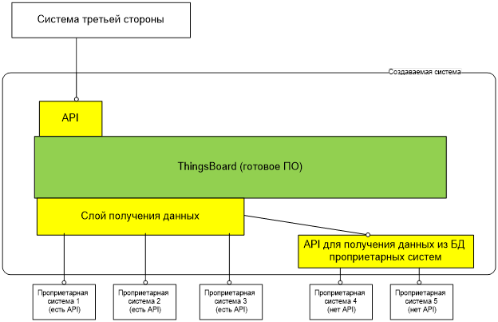

# smart-farm-hub
Проект умной облачной фермы.

# 1.	Цели системы
## 1.1.	Агрегация данных

Система должна собирать данные из проприетарных систем управления, используемых на сельскохозяйственных предприятиях, в единую БД. Эти данные используются для реализации остальных целей.

## 2.	Возможная реализация системы

Как один из возможных вариантов можно рассматривать применение продукта с открытым кодом [ThingsBoard](https://thingsboard.io/). При этом потребуется произвести разработку ПО, обеспечивающего получение данных от проприетарных систем. На рисунке ниже жёлтым показано ПО, которое надо разработать и зеленым – готовое ПО, которое можно применить без переделок.

